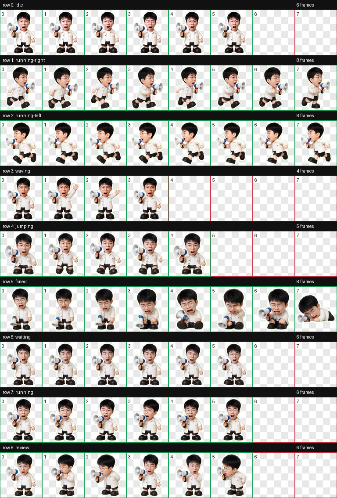

# 金金 Codex Pet

金金是一个 Codex 自定义宠物：戴细圆眼镜、白色外套、黑短裤、大黑鞋，手里拿着蓝白小喇叭。

## Preview



## Install

### Windows PowerShell

From this repository folder:

```powershell
.\install.ps1
```

Then restart Codex or reload the pet picker if it is already open.

### Manual Install

Copy the `jinjin` folder into your Codex pets folder:

```text
%USERPROFILE%\.codex\pets\jinjin
```

The final installed files should be:

```text
%USERPROFILE%\.codex\pets\jinjin\pet.json
%USERPROFILE%\.codex\pets\jinjin\spritesheet.webp
```

## Files

- `jinjin/pet.json` - pet manifest
- `jinjin/spritesheet.webp` - animated pet atlas
- `preview/contact-sheet.png` - QA preview sheet
